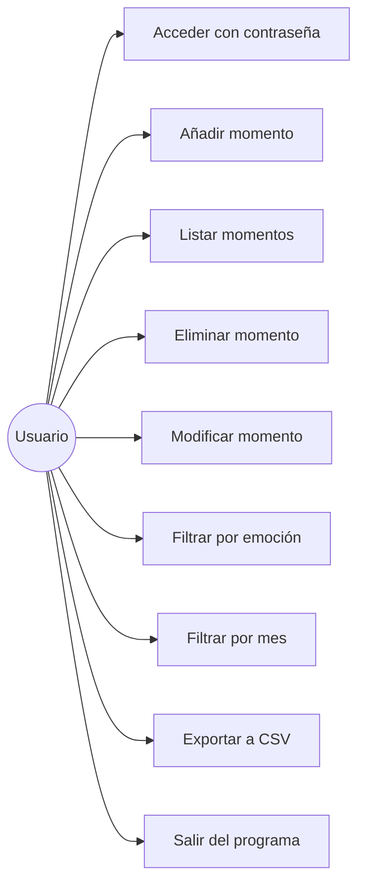
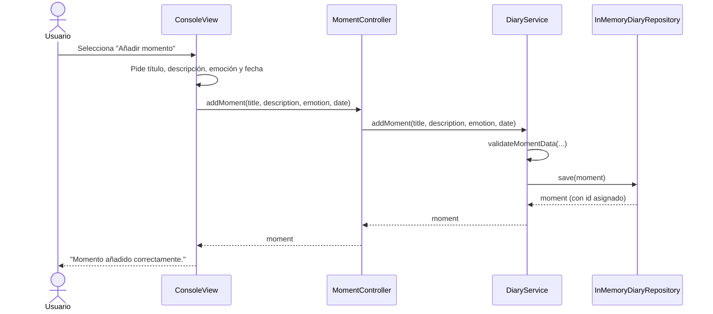
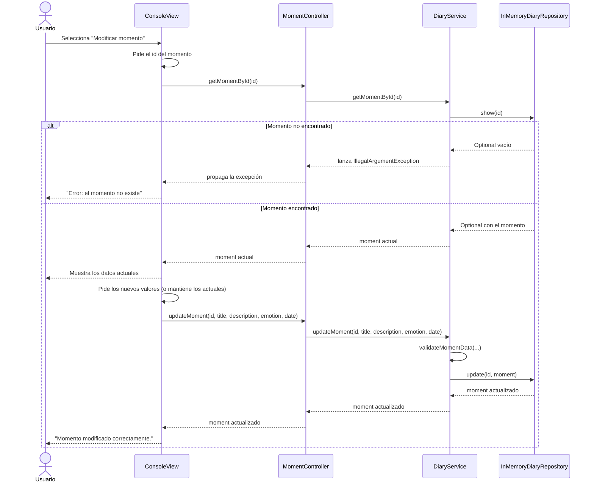
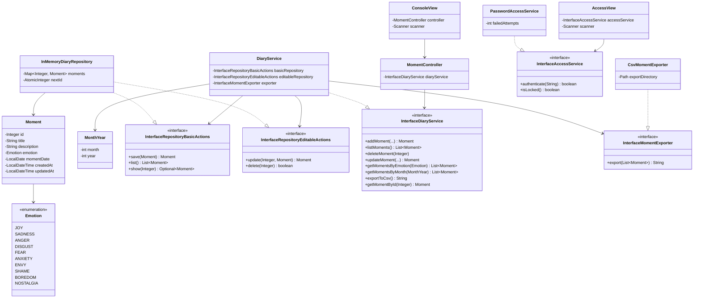
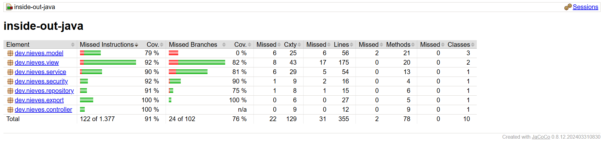
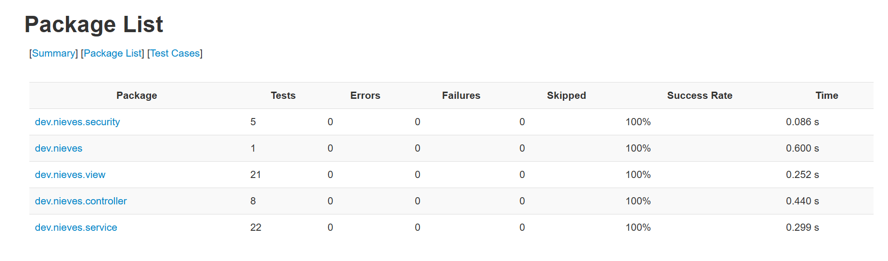

# Inside Out ( Mi Diario)

## 🔍 Índice

- [Descripción](#-descripción)
- [Pre-requisitos](#%EF%B8%8F-pre-requisitos)
- [Estructura de carpetas](#-estructura-de-carpetas)
- [Instalación](#%EF%B8%8F-instalación)
- [Ejecución de los tests](#-ejecución-de-los-tests)
- [Historias de Usuario y Criterios de Aceptación](#-historias-de-usuario-y-criterios-de-aceptación)
- [Diagramas](#-diagramas)
- [Capturas](#-capturas)
- [Autora](#%EF%B8%8F-autora)


---

## 📝 Descripción

Aplicación de consola desarrollada en Java que permite al usuario gestionar sus momentos vividos ("Mi Diario"). Cada momento registra un título, una descripción, una emoción asociada y la fecha en la que ocurrió, además de metadatos de creación y modificación. El usuario puede añadir, listar, eliminar y filtrar momentos por emoción o por mes, exportarlos a un archivo CSV, y accede a la aplicación mediante una contraseña.

El proyecto sigue una arquitectura por capas (Vista → Controlador →
Servicio → Repositorio → Modelo), aplicando principios SOLID, inyección
de dependencias con Guice, y una cobertura de tests del 91 %.

---

## ⚙️ Pre-requisitos

- Java 21
- Apache Maven
- Git
---

## 📁 Estructura de carpetas

## Estructura de carpetas

```
Inside-Out-Java/
├── docs/
│   ├── 57-tests-run.png
│   └── tests-coverage.png
├── exports/                          # Archivos CSV generados por la app (ignorado en Git)
├── src/
│   ├── main/
│   │   └── java/dev/nieves/
│   │       ├── config/                # Configuración de Guice (inyección de dependencias)
│   │       ├── controller/            # Coordina la Vista con el Service
│   │       ├── export/                # Exportación de momentos a CSV
│   │       ├── model/                 # Entidades y Value Objects del dominio
│   │       ├── repository/            # Acceso a datos (Map en memoria)
│   │       ├── security/              # Control de acceso por contraseña
│   │       ├── service/               # Lógica de negocio
│   │       ├── view/                  # Entrada/salida por consola
│   │       └── App.java               # Punto de entrada de la aplicación
│   └── test/
│       └── java/dev/nieves/
│           ├── controller/
│           ├── security/
│           ├── service/
│           ├── view/
│           └── AppTest.java
├── .editorconfig
├── .gitignore
├── pom.xml
└── README.md
```

---

## 🛠️ Instalación

1. Clonar el repositorio:
```bash
   git clone https://github.com/duran-ni/Inside-Out-Java
```
2. Compilar el proyecto:
```bash
   mvn clean install
```
3. Ejecutar la aplicación:
```bash
   mvn compile exec:java -Dexec.mainClass="dev.nieves.App"
```
La aplicación solicitará una contraseña de acceso: `diario2026` (Por seguridad, el código no almacena la contraseña en texto plano — internamente se valida contra su hash SHA-256, ver `PasswordAccessService.java`.)

> **Nota:** en Windows, si usas Git Bash, los caracteres con tilde/ñ pueden
> mostrarse incorrectamente en la terminal por un problema de codificación
> de la propia terminal (no del programa). Se recomienda usar Command
> Prompt o PowerShell con `chcp 65001` ejecutado previamente.
---

## ✅ Ejecución de los tests

```bash
mvn test
```
---

## 📋 Historias de Usuario y Criterios de Aceptación

### HU1 - Añadir un momento vivido

**COMO** usuario
**QUIERO** añadir un momento vivido
**PARA** poder visualizarlo cuando lo necesite recordar

- **Dado** que estoy en el menú principal, **cuando** selecciono "Añadir momento", **entonces** el sistema me solicita título, fecha del momento, descripción y emoción.

- **Dado** que introduzco todos los datos válidos, **cuando** confirmo,
  **entonces** el momento se guarda con un identificador único autogenerado,
  fecha de creación y fecha de modificación asignadas automáticamente.

- **Dado** que el título o la descripción están vacíos, **cuando** confirmo, **entonces** el sistema muestra un error y no guarda el momento.

- **Dado** que la fecha introducida no tiene el formato dd/mm/yyyy o la emoción no es una opción válida (1-10), **cuando** confirmo, **entonces** el sistema muestra un error y no guarda el momento.

### HU2 - Listar momentos vividos

**COMO** usuario **QUIERO** recuperar la lista de los momentos vividos registrados **PARA** poder repasarlos

- **Dado** que existen momentos registrados, **cuando** selecciono "Ver todos los momentos disponibles", **entonces** se muestran todos incluyendo identificador, fecha, título, descripción y emoción.

- **Dado** que no hay ningún momento registrado, **cuando** selecciono esa opción, **entonces** el sistema informa de que la lista está vacía (no lanza error).

### HU3 - Eliminar un momento vivido

**COMO** usuario **QUIERO** suprimir un momento vivido **PARA** evitar duplicados y mantener la lista organizada

- **Dado** que existe un momento con un identificador concreto, **cuando**
  selecciono "Eliminar" e introduzco ese identificador, **entonces** el momento se elimina del Map y se confirma la operación.

- **Dado** que introduzco un identificador inexistente, **cuando** confirmo, **entonces** el sistema informa de que no existe ese momento y no elimina nada.

### HU4 - Filtrar por emoción

**COMO** usuario **QUIERO** obtener los momentos vividos según su emoción **PARA** poder visualizarlos

- **Dado** que existen momentos con distintas emociones, **cuando** filtro por una emoción concreta (seleccionada de la lista cerrada de 10 opciones), **entonces** solo se muestran los momentos con esa emoción.

- **Dado** que ningún momento tiene la emoción seleccionada, **cuando** filtro, **entonces** el sistema informa de que no hay resultados.

### HU5 - Filtrar por mes

**COMO** usuario **QUIERO** obtener los momentos vividos en un mes determinado **PARA** poder repasar cómo me sentía en esa etapa concreta

- **Dado** que existen momentos en distintas fechas, **cuando** filtro por fecha introduciendo una fecha completa (dd/mm/yyyy), **entonces** el sistema compara únicamente el mes y el año de esa fecha (ignorando el día) y muestra todos los momentos cuyo mes y año coinciden.

- **Dado** que ningún momento pertenece a ese mes y año, **cuando** filtro, **entonces** el sistema informa de que no hay resultados.

- **Dado** que la fecha introducida no tiene el formato dd/mm/yyyy, **cuando** filtro, **entonces** el sistema muestra un error y solicita el dato de nuevo.

### HU6 - Salir del programa

**COMO** usuario **QUIERO** salir del programa **PARA** poder iniciar otro

- **Dado** que estoy en el menú principal, **cuando** selecciono "Salir",
  **entonces** el programa muestra un mensaje de despedida y finaliza la ejecución limpiamente (sin excepciones ni procesos colgados).

### HU7 - Modificar datos de un momento vivido

**COMO** usuario **QUIERO** modificar cualquier dato de un momento vivido (título, descripción, emoción o fecha del momento) **PARA** mantener mi diario actualizado cuando necesite corregir o ampliar información.

 - **Dado** que existe un momento con un identificador concreto, **cuando** selecciono "Modificar" e introduzco ese identificador, **entonces** el sistema me muestra los datos actuales y me permite editar título, descripción, emoción y/o fecha del momento.

 - **Dado** que introduzco al menos un dato nuevo válido, **cuando** confirmo, **entonces** el momento se actualiza con los nuevos valores y la fecha de modificación se actualiza automáticamente (la fecha de creación no cambia).

 - **Dado** que introduzco un identificador inexistente, **cuando** confirmo, **entonces** el sistema informa de que no existe ese momento y no modifica nada.

 - **Dado** que dejo el título o la descripción vacíos, **cuando** confirmo, **entonces** el sistema muestra un error y no guarda los cambios.

 - **Dado** que introduzco una fecha con formato distinto de dd/mm/yyyy o una emoción fuera del rango válido (1-10), **cuando** confirmo, **entonces** el sistema muestra un error y no guarda los cambios.

 ### HU8 - Generar un archivo de momentos vividos en formato CSV

 **COMO** usuario **QUIERO** generar la lista completa de momentos vividos en un archivo CSV **PARA** guardar, compartir o analizar mis recuerdos fuera de la aplicación.

 - **Dado** que existen momentos registrados, **cuando** selecciono "Exportar a CSV", **entonces** se genera un archivo .csv con una fila por momento, incluyendo identificador, título, descripción, emoción, fecha del momento, fecha de creación y fecha de modificación.

 - **Dado** que se genera el archivo correctamente, **cuando** finaliza la exportación, **entonces** el sistema confirma la ruta/nombre del archivo generado.

 - **Dado** que no existe ningún momento registrado, **cuando** selecciono "Exportar a CSV", **entonces** el sistema informa de que no hay datos que exportar y no genera un archivo vacío.

 **Dado** que ocurre un error de escritura (por ejemplo, permisos o ruta inválida), **cuando** se intenta generar el archivo, **entonces** el sistema muestra un mensaje de error controlado (sin cerrar la aplicación de forma inesperada).

 ### HU9 - Acceso protegido por contraseña

 **COMO** usuario **QUIERO** acceder a mi diario únicamente mediante una contraseña **PARA** asegurar que mis momentos vividos estén protegidos y solo yo pueda consultarlos.

- **Dado** que inicio la aplicación, **cuando** se muestra la pantalla inicial, **entonces** el sistema solicita una contraseña antes de mostrar el menú principal.

- **Dado** que introduzco la contraseña correcta, **cuando** confirmo, **entonces** el sistema me da acceso al menú principal.

- **Dado** que introduzco una contraseña incorrecta, **cuando** confirmo, **entonces** el sistema muestra un mensaje de error y no me da acceso al menú principal.

- **Dado** que agoto un número máximo de intentos fallidos (3), **cuando** ocurre el último intento fallido, **entonces** el sistema finaliza la ejecución de forma controlada.
---

## 🧮 Diagramas

 ### Diagrama de casos de uso



### Diagrama de secuencia (ejemplo: Añadir momento)



### Diagrama de secuencia (ejemplo: Modificar momento)



### Diagrama de clases




---

## 📷 Capturas

### Tests en verde y Coverage




---

## ✍️ Autora

duran-ni
